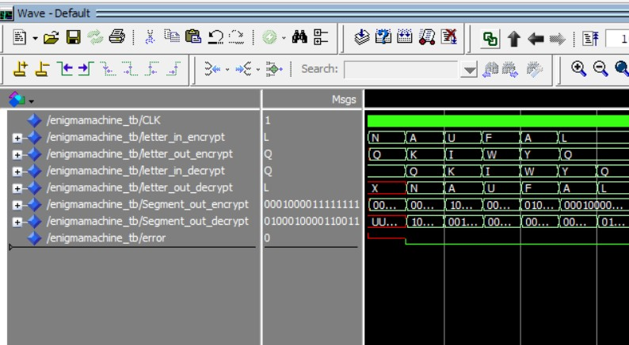

# Final Project PSD B2 - Enigma Machine Reimplementation on VHDL


## Background


An Enigma Machine is one of the most sophisticated encryption machines in the 20th century. It was commonly used during World War II by the German Military to send an encrypted message to one another without the enemies being able to know what the message actually contains. This encryption was then cracked by Allied forces thanks to earlier decryption attempts by Poland under the leadership of mathematician Marian Rejewski in the early 1930s. However, there weren’t any notable developments until Bletchley Park, a secret British intelligence facility, discovered a breakthrough thanks to the Bombe machine, a machine which can decrypt Enigma text faster than it would take an average human 

Our project aims to recreate the functionality of the Enigma machine using VHDL, a hardware description language used to design and simulate digital systems. VHDL allows us to accurately model the Enigma's rotors and reflectors, as well as its plugboard for additional encryption. By reimplementing the Enigma in VHDL, we hope to gain a better understanding of how it worked and how it was eventually broken.


Our design is based on this [Python](https://www.101computing.net/enigma/) source code. 

## How it works
When user enters the input it will pass a several component, the first one is the plugboard. The plugboard allowed the user to connect pairs of letters, so that when one letter was entered, the signal would go through the plugboard component and be replaced with the pair letter that is configured in the configuration file before passing through the rotors and the electrical circuit. After that the signal would go through the rotor array to scramble the signal further before arriving in the reflector which reflects the signal back to the rotor array from the opposite side. Finally, the signal go through the plugboard once more and can be read directly or passed to an encoder which can be displayed on a 16-segment display.

### Keyboard
The keyboard works as an input device that receives input from the user. It receives the input in `Data_in: IN std_logic_vector(7 downto 0);` and outputs it in `Data_out: OUT std_logic_vector(7 downto 0);`. It receive input as an ASCII binary from A to Z. Input other than that will invoke 
```
else
    error <= '1';
    Data_out(7 downto 0) <= "00000000";
end if;
```
resulting in error and outputs 00000000.
                

### Plugboard
The plugboard functions to swap pairs of two letters based on configuration stored in 'EnigmaConstants.vhd' the plugboard configuration is shown below
```
CONSTANT PLUGBOARDMAP : PLUGBOARD_CONFIG := (
        -- TSCEDMGHRJNZFKWVQIBAUPOYXL
        -- AT BS DE FM IR KN LZ OW PV XY
        "01010100", "01010011", "01000011", "01000101", "01000100", "01001101", "01000111",
        "01001000", "01010010", "01001010", "01001110", "01011010", "01000110", "01001011",
        "01010111", "01010110", "01010001", "01001001", "01000010", "01000001", "01010101",
        "01010000", "01001111", "01011001", "01011000", "01001100"
    );
```
Our design works by accessing the index from the configuration array above by converting the input ASCII bit to integer and modulo it with 65, the result is the index of that corresponding input which in it contains the other letter pair to be swap. To do that operation we used
```
letter_out <= plugboardConst(to_integer(unsigned(letter_in)) MOD 65);
```

### Rotor and reflector
The rotor works by receiving input and passes it through a series of rotor. The rotors have their each configuration to scramble letters listed below
```
CONSTANT ROTOR_A_MAP : ROTOR_CONFIG := (
        -- "ABCDEFGHIJKLMNOPQRSTUVWXYZ"
        -- "EKMFLGDQVZNTOWYHXUSPAIBRCJ"
        "01000101", "01001011", "01001101", "01000110", "01001100", "01000111", "01000100",
        "01010001", "01010110", "01011010", "01001110", "01010100", "01001111", "01010111",
        "01011001", "01001000", "01011000", "01010101", "01010011", "01010000", "01000001",
        "01001001", "01000010", "01010010", "01000011", "01001010"
    );

    CONSTANT ROTOR_B_MAP : ROTOR_CONFIG := (
        -- "AJDKSIRUXBLHWTMCQGZNPYFVOE"
        "01000001", "01001010", "01000100", "01001011", "01010011", "01001001", "01010010",
        "01010101", "01011000", "01000010", "01001100", "01001000", "01010111", "01010100",
        "01001101", "01000011", "01010001", "01000111", "01011010", "01001110", "01010000",
        "01011001", "01000110", "01010110", "01001111", "01000101"
    );

    CONSTANT ROTOR_C_MAP : ROTOR_CONFIG := (
        -- "BDFHJLCPRTXVZNYEIWGAKMUSQO"
        "01000010", "01000100", "01000110", "01001000", "01001010", "01001100", "01000011",
        "01010000", "01010010", "01010100", "01011000", "01010110", "01011010", "01001110",
        "01011001", "01000101", "01001001", "01010111", "01000111", "01000001", "01001011",
        "01001101", "01010101", "01010011", "01010001", "01001111"
    );
    CONSTANT ROTOR_D_MAP : ROTOR_CONFIG := (
        -- "ESOVPZJAYQUIRHXLNFTGKDCMWB"
        "01000101", "01010011", "01001111", "01010110", "01010000", "01011010", "01001010",
        "01000001", "01011001", "01010001", "01010101", "01001001", "01010010", "01001000",
        "01011000", "01001100", "01001110", "01000110", "01010100", "01000111", "01001011",
        "01000100", "01000011", "01001101", "01010111", "01000010"
    );

```
The types of rotor used is determined with this code.
```
IF rotor_type = "00" THEN
	ROTOR_MAP <= ROTOR_A;
ELSIF rotor_type = "01" THEN
	ROTOR_MAP <= ROTOR_B;
ELSIF rotor_type = "10" THEN
	ROTOR_MAP <= ROTOR_C;
ELSE
	ROTOR_MAP <= ROTOR_D;
END IF;
```

After the signal has gone through all three rotors it will enter the reflector and be reflected back towards the rotors. Because of this we need to know where is the direction of the signal. We used code below to check the direction and reversed the mapping for each rotor.
```
IF direction = '0' THEN
	FOR idx IN 0 TO 25 LOOP
	    IF letterIn = ALPHABETS(idx) THEN
			letterOut <= ROTOR_MAP((idx + offset) MOD 26);
			EXIT;
		END IF;
	END LOOP;
-- If direction is '1' or backwards
ELSE
    FOR idx IN 0 TO 25 LOOP
		IF letterIn = ROTOR_MAP((idx + offset) MOD 26) THEN
			letterOut <= ALPHABETS((idx) MOD 26);
			EXIT;
		END IF;
	END LOOP;
END IF;
```
For each input, the first rotor will turn, changing the scramble pattern of the signal. We use this code to make the first rotor turn for each input.
```
IF firstRotor = '1' AND direction = '1' THEN
	offset := (offset + 1) MOD 26;
END IF;

```

## How to use
Our design works by receiving binary ASCII input signal in form of `std_logic_vector(7 downto 0)` represented by the . The program then pass it towards the entire mechanism and ended in 16-Segment display encoder which can be displayed in 16-Segment display. User can also change the enigma configuration by modifying the constants located in `EnigmaConstants.vhd` or by swapping the rotor order in  `RotorAndReflector.vhd`. 

If user wants to encrypt and decrypt a message, they have to do two different instances of simulation first to encrypt then reset the simulation and enter the output from the first instance to decrypt.

## Testing
We validated our design by running two instances simultaneously. To encrypt and decrypt. We give input to the former and passes the ouput directly to the latter. If both input and output matches in pair then our design is considered a success.
## Result
Our testing result shows that the input and output are indeed matched in pairs, that means our design works as we intended it to. Below is the simulation result.

